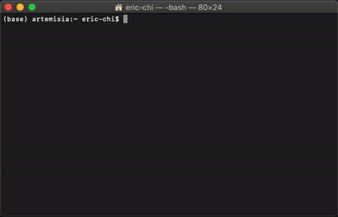
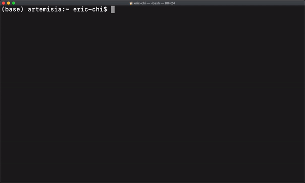

# tigrex
[](https://paypal.me/ericjaychi?locale.x=en_US)  

tigrex is a Python CLI Tool for searching and pricing Magic the Gathering cards using Scryfall's API.

## Installation

**pip**

Use the package manager [pip](https://pip.pypa.io/en/stable/) to install tigrex.

```bash
pip install tigrex
```

**Homebrew**

Use Homebrew to install tigrex.

```bash
brew tap ericjaychi/tigrex
brew install tigrex
```

**Cloning**

Clone the repository and run the script locally. This method will mean that each command has to have `python -m tigrex`.
```bash
git clone https://github.com/ericjaychi/tigrex.git || git@github.com:ericjaychi/tigrex.git
cd tigrex/
python -m tigrex [command]
```

## Usage
All searches leverage a fuzzy search, meaning that the `[card_name]` does not have to be exact. Examples:
- `yuriko` will result in a search result of `Yuriko, the Tiger's Shadow`
- `watery` will result in a search result of `Watery Grave`

If a full name needs to be searched for, wrapping the `[card_name]` in `" "` can achieve this, `"[card_name]"`. Examples:
- `"yuriko, the tiger's shadow"` will result in a search result of `Yuriko, the Tiger's Shadow`
- `"watery grave"` will result in a search result of `Watery Grave`

Fuzzy search will fail if there are multiple results. Examples:`
- `path to` will fail and not bring up the card `Path to Exile``
- `"path to"` will fail and not bring up the card `Path to Exile`

## Commands
**search** - Search for an MTG card.
```bash
tigrex search [card-name]
```


**price** - Search for an MTG card price.
```
tigrex price [card-name]
```


**currency** - Set the currency of the card searches inside of `config.ini` so that price shows in the either USD, EUR, or TIX. Foil prices are only in USD.
```
tigrex currency [usd | eur | tix]
```


## Contributing
Pull requests are welcome. For major changes, please open an issue first to discuss what you would like to change.

Please make sure to update tests as appropriate.

Although this is an open source tool, donations are appreciated greatly!

## License
[MIT](https://choosealicense.com/licenses/mit/)
